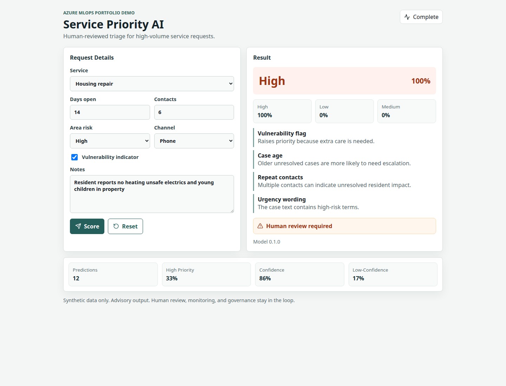
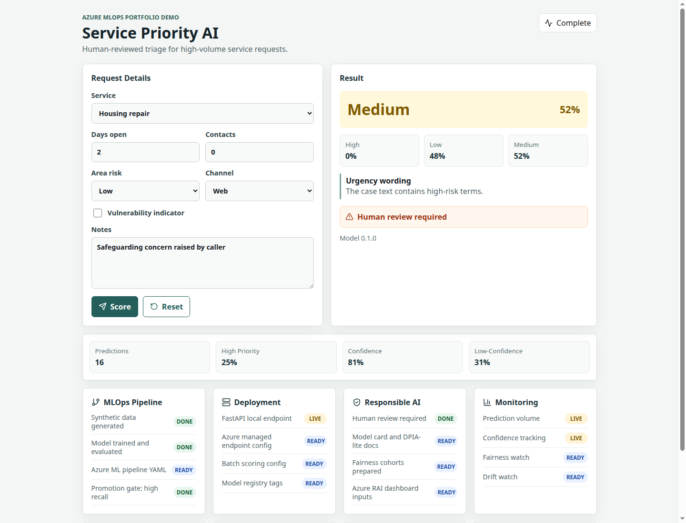
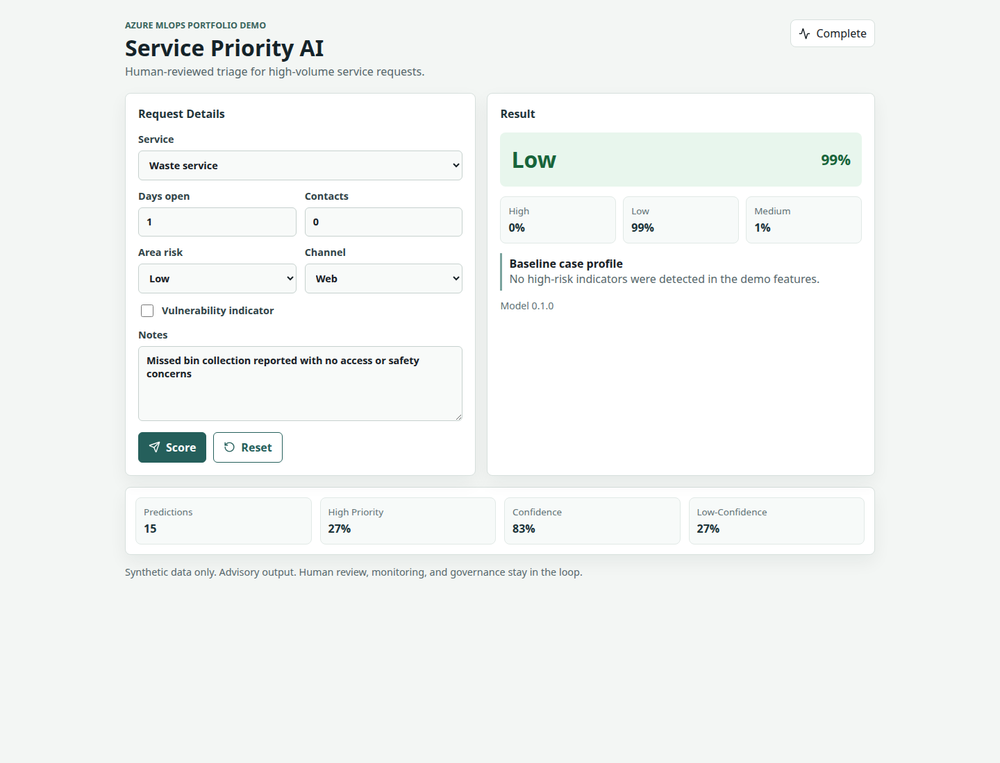

# Service Priority AI

An end-to-end Azure MLOps and Responsible AI portfolio project for service request triage.

Service Priority AI demonstrates how a machine learning system can be designed, delivered, governed, and monitored in a realistic public-sector decision-support workflow. The project predicts a fictional service request priority of `low`, `medium`, or `high`, then presents the recommendation with confidence scores, explanation factors, and operational monitoring signals so a human reviewer can make the final decision.

This repository is built to show employer-ready engineering judgement, not just model training. It combines a tested FastAPI prediction service, a React triage dashboard, synthetic data generation, scikit-learn model training, Azure Machine Learning deployment assets, CI validation, monitoring contracts, and Responsible AI documentation covering model cards, DPIA-lite thinking, fairness, drift, human oversight, and safe-use boundaries.

## Portfolio Highlights

- End-to-end ML delivery: data generation, training, evaluation artifacts, API serving, frontend consumption, monitoring, and deployment documentation.
- Azure-ready MLOps structure: pipeline, environment, endpoint, batch scoring, and deployment YAML assets designed for Azure Machine Learning CLI v2.
- Responsible AI by design: human-in-the-loop positioning, model card, DPIA-lite assessment, fairness and drift monitoring concepts, and explicit limitations for synthetic demo data.
- Production-style implementation: typed API schemas, FastAPI tests, CI workflow, package-managed frontend, and clearly documented integration contracts.
- Employer-relevant scenario: a practical triage workflow that reflects the governance, reliability, auditability, and communication skills expected in applied AI roles.

## Technical Scope

- **Machine learning:** synthetic case data, feature contract, scikit-learn training pipeline, persisted model artifact, evaluation metrics, and model metadata.
- **Backend:** FastAPI service with typed request/response schemas, health checks, prediction endpoint, monitoring summary endpoint, and automated API tests.
- **Frontend:** React triage dashboard for reviewing recommendations, confidence, explanation factors, and service-level monitoring signals.
- **MLOps:** Azure ML pipeline, environment, online endpoint, batch endpoint, deployment notes, CI validation, and reproducible local commands.
- **Governance:** Responsible AI assessment, DPIA-lite, model card, monitoring strategy, acceptance criteria, and clear human accountability boundaries.

## Dashboard Screenshots

These screenshots show real responses from the running FastAPI model service, captured through the React dashboard with different case profiles.

### High Priority



### Medium Priority



### Low Priority



## Project Structure

```text
.
├── backend/          # FastAPI app and API tests
├── frontend/         # React dashboard
├── ml/               # synthetic data, training, artifacts
├── monitoring/       # monitoring metric definitions and generated summaries
├── azure/            # Azure ML starter configs and deployment notes
├── docs/             # governance, architecture, and portfolio documentation
└── PLAN.md           # detailed build plan
```

## Local Setup

Create a Python environment and install the backend/ML dependencies:

```bash
python3 -m venv .venv
source .venv/bin/activate
pip install -r requirements.txt
```

Generate synthetic data and train the baseline model:

```bash
python ml/generate_data.py
python ml/train_model.py
```

Run the API:

```bash
uvicorn backend.app.main:app --reload --port 8010
```

Run the frontend in another terminal:

```bash
cd frontend
npm install
VITE_API_BASE=http://localhost:8010 npm run dev
```

Open the dashboard at the Vite URL, usually `http://localhost:5173`.

## API Example

```bash
curl -X POST http://localhost:8010/predict \
  -H "Content-Type: application/json" \
  -d '{
    "service_type": "housing",
    "days_open": 5,
    "previous_contacts": 4,
    "vulnerability_flag": true,
    "deprivation_band": "high",
    "channel": "phone",
    "urgency_text": "Customer has no heating and there are young children in the property"
  }'
```

## Responsible AI Position

This demo uses synthetic data. It is not suitable for real residents or live services without formal data governance, DPIA, equality impact assessment, security review, user testing, human override design, and operational monitoring.

The intended design is advisory. A human officer remains accountable for decisions and can override the model.
