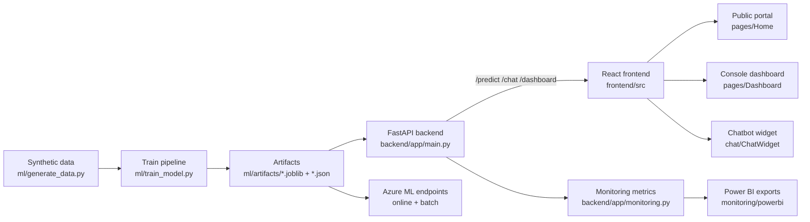

# 02 — Architecture

End-to-end flow from synthetic data to the operator dashboard.



## Layers
| Layer | Where | Notes |
|---|---|---|
| Data | `ml/generate_data.py`, `ml/data/synthetic_cases.csv` | 25,000 synthetic Essex-style service requests |
| Training | `ml/train_model.py` | scikit-learn pipeline → [[06 - Model]] |
| Artifacts | `ml/artifacts/` | `case_priority_model.joblib`, `evaluation.json`, `model_metadata.json`, `shap_summary.json`, `gate_summary.json`, `registry_tags.json` |
| API | `backend/app/main.py` | routes below |
| Model service | `backend/app/model_service.py` | loads joblib, predicts, explains, attributions |
| Assistant | `backend/app/chat.py` | grounded chatbot → [[05 - Chatbot]] |
| Frontend | `frontend/src/` | → [[03 - Frontend]] |
| Deployment | `azure/` | → [[08 - Azure-Deployment]] |
| Monitoring | `backend/app/monitoring.py`, `monitoring/` | → [[07 - Responsible-AI]] |

## Backend routes
- `GET /health` — model load status
- `POST /predict` — score a [[10 - Glossary|CaseRequest]]
- `POST /chat` — grounded assistant → [[05 - Chatbot]]
- `GET /metrics/summary` — live operational metrics
- `GET /model/metadata` — registry metadata
- `GET /explainability/sample` — worked example
- `GET /dashboard/summary` — aggregated panel data → [[04 - Dashboard]]

## Run locally
```bash
# backend
PYTHONPATH=. .venv/bin/uvicorn backend.app.main:app --port 8010
# frontend (dev server on :5173, CORS-allowed)
cd frontend && npm run dev
```

#servicePriorityAI #architecture
